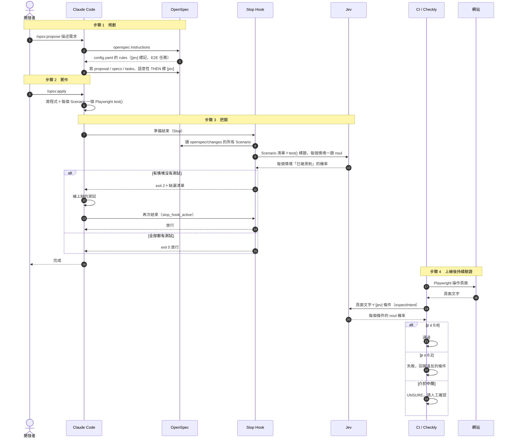
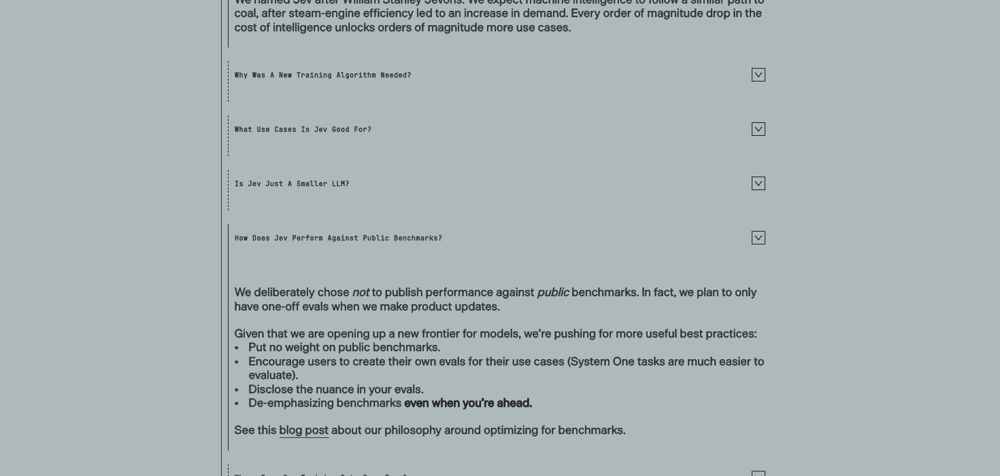
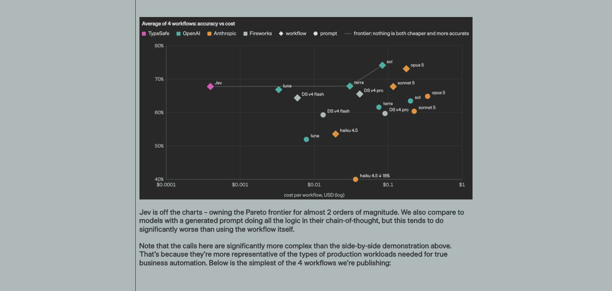
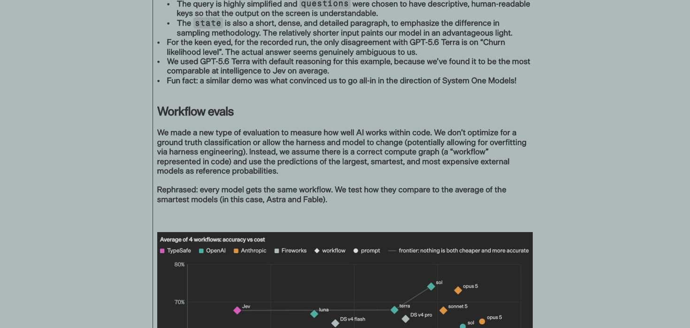
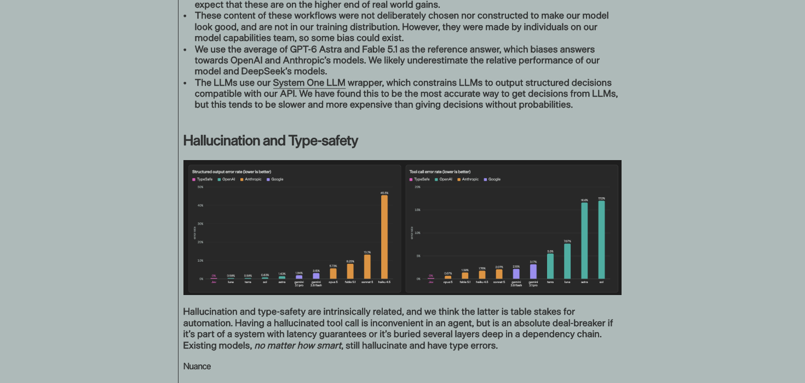
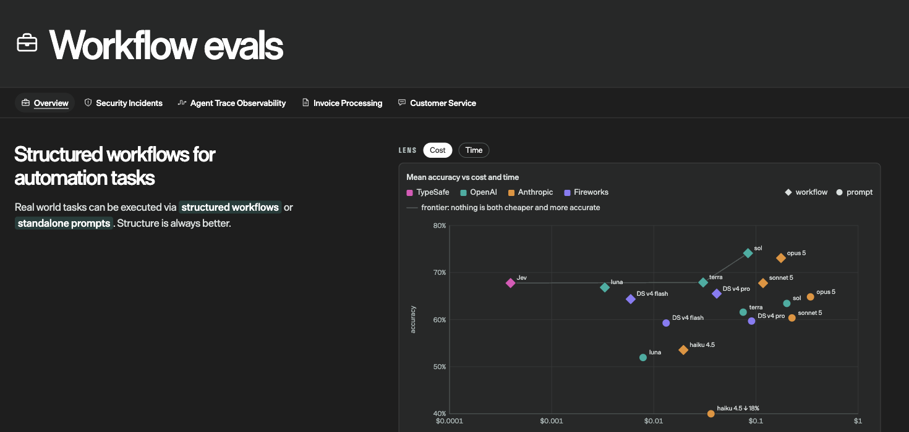

# Jev 決策模型工作坊｜學員資源

短網址：**https://tinyurl.com/jevtw2026**

這裡放講義與所有可以直接複製的程式碼。每個灰色程式框右上角都有「複製」按鈕，點一下就能複製。

- 📄 講義：[Jev講義.pdf](handout/Jev講義.pdf)（可列印）｜[Jev講義.docx](handout/Jev講義.docx)（可編輯）
- 🧪 Playground：<https://console.typesafe.ai/playground>（用 Google 帳號登入）

---

## 🎬 實測影片

每支影片都是在 TypeSafe Playground 或命令列實際操作錄下來的畫面（2026/09/29），點連結即可在瀏覽器播放。

| 影片 | 內容 | 長度 |
| --- | --- | --- |
| [▶ 完整版](https://hirosichen.github.io/jev-workshop/videos/00-full-tutorial.mp4) | 實作一 → 實作二 → 四個案例 | 2 分 25 秒 |
| [▶ 實作一：Playground](https://hirosichen.github.io/jev-workshop/videos/01-hands-on-playground.mp4) | 貼資料、貼題目、按 Run、看結果 | 22 秒 |
| [▶ 實作二：命令列](https://hirosichen.github.io/jev-workshop/videos/02-hands-on-terminal.mp4) | Windows PowerShell 與 Mac 終端機呼叫 Jev | 33 秒 |
| [▶ 案例 1：電商評論](https://hirosichen.github.io/jev-workshop/videos/03-case1-review.mp4) | 一次問 4 題 | 22 秒 |
| [▶ 案例 2：詐騙簡訊](https://hirosichen.github.io/jev-workshop/videos/04-case2-scam.mp4) | 看懂意思，不靠關鍵字 | 22 秒 |
| [▶ 案例 3：履歷初篩](https://hirosichen.github.io/jev-workshop/videos/05-case3-resume.mp4) | 條件逐項判斷 | 22 秒 |
| [▶ 案例 4：說不清楚的客訴](https://hirosichen.github.io/jev-workshop/videos/06-case4-unclear.mp4) | 不確定時會說不確定 | 23 秒 |

> Jev 的結果是機率，每次執行可能相差幾個百分點，所以影片、講義與你自己跑出的數字不會完全一樣。

---

## 實作一：不寫程式，用 Playground 做第一個判斷

1. 用 Chrome 開啟 <https://console.typesafe.ai>，點「Continue with Google」登入。
2. 點左側「Playground」。
3. 把下面兩段分別貼到左上「State」與左下「Questions」（先全選原本內容再貼上）。
4. 按右下角「Run」，看右側 Response。

### 實作一範例：客服訊息分流

[▶ 看實測影片](https://hirosichen.github.io/jev-workshop/videos/01-hands-on-playground.mp4)

預期結果：angry 約 92% true、team 選 tech（100%）、urgency 為 2 of 2（很急）。

**State（貼到左上）**

```json
{
  "message": "你們的 App 一直閃退，我已經重灌三次了，再這樣我要取消訂閱！"
}
```

**Questions（貼到左下）**

```json
{
  "angry": {
    "type": "noul",
    "instructions": "`message` 的作者是否很生氣？"
  },
  "team": {
    "type": "choice",
    "instructions": "這則 `message` 應該交給哪個部門？",
    "criteria": {
      "billing": "帳務、扣款、退款",
      "tech": "故障、錯誤、閃退",
      "sales": "價格、方案、購買"
    }
  },
  "urgency": {
    "type": "score",
    "instructions": "這則 `message` 有多緊急？",
    "criteria": [
      "不急：一般詢問",
      "有點急：影響使用但可以等",
      "很急：客戶可能流失"
    ]
  }
}
```

---

## 實作二：從自己的電腦呼叫 Jev

先到 Console 左側「API Keys」→「Create key」建立金鑰。**金鑰等同密碼，不要貼到 LINE、Email 或公開的地方。**

### Windows（PowerShell）

[▶ 看實測影片](https://hirosichen.github.io/jev-workshop/videos/02-hands-on-terminal.mp4)

按開始鍵，輸入 PowerShell 開啟，把第一行換成你的金鑰後整段貼上：

```powershell
# Jev 實作二（Windows PowerShell）：先把下一行換成你的金鑰，整段貼上後按 Enter
$env:TYPESAFE_API_KEY = "貼上你的金鑰"
$body = @'
{ "model": "jev-latest",
  "state": { "message": "你們的 App 一直閃退，我已經重灌三次了！" },
  "questions": { "angry": { "type": "noul", "instructions": "`message` 的作者是否很生氣？" } } }
'@
Invoke-RestMethod -Uri "https://api.typesafe.ai/v1/systemone" -Method Post `
  -Headers @{ Authorization = "Bearer $env:TYPESAFE_API_KEY" } `
  -ContentType "application/json; charset=utf-8" `
  -Body ([Text.Encoding]::UTF8.GetBytes($body)) | ConvertTo-Json -Depth 6
```

### Mac（終端機）

按 ⌘＋空白鍵，輸入「終端機」開啟，把第一行換成你的金鑰後整段貼上：

```bash
# Jev 實作二（Mac 終端機）：先把下一行換成你的金鑰，整段貼上後按 Enter
export TYPESAFE_API_KEY="貼上你的金鑰"
curl -s https://api.typesafe.ai/v1/systemone -H "Authorization: Bearer $TYPESAFE_API_KEY" \
  -H "Content-Type: application/json" -d '{"model":"jev-latest","state":{"message":"你們的 App 一直閃退！"},
  "questions":{"angry":{"type":"noul","instructions":"`message` 的作者是否很生氣？"}}}'
```

看到 `"noul": 0.91` 這類數字就成功了：代表「是」的機率 91%。

---

## 案例篇：四個例子看懂 Jev 的優勢

每個案例都可以照樣貼進 Playground 自己試。

### 案例 1　電商評論分析｜一次問 4 題，約 0.3 秒

[▶ 看實測影片](https://hirosichen.github.io/jev-workshop/videos/03-case1-review.mp4)

講義實測：有好有壞 83%｜抱怨物流 95%｜商品瑕疵 17%｜推薦意願 2（最高級）。

**State（貼到左上）**

```json
{
  "review": "等了快兩週才到貨，外盒還壓扁了。不過耳機音質真的很好，降噪也比我原本那副強，價格來說很划算，會推薦給朋友。"
}
```

**Questions（貼到左下）**

```json
{
  "sentiment": {
    "type": "choice",
    "instructions": "`review` 整體的情緒是？",
    "criteria": {
      "positive": "整體滿意",
      "mixed": "有好有壞",
      "negative": "整體不滿"
    }
  },
  "shipping_issue": {
    "type": "noul",
    "instructions": "`review` 是否抱怨物流或配送？"
  },
  "product_defect": {
    "type": "noul",
    "instructions": "`review` 是否說商品本身有瑕疵或故障？"
  },
  "recommend": {
    "type": "score",
    "instructions": "作者推薦這個商品的意願有多高？",
    "criteria": [
      "不推薦：勸別人不要買",
      "普通：沒有明確推薦",
      "推薦：明確說會推薦給別人"
    ]
  }
}
```

### 案例 2　詐騙簡訊判斷｜看懂意思，不靠關鍵字

[▶ 看實測影片](https://hirosichen.github.io/jev-workshop/videos/04-case2-scam.mp4)

講義實測：詐騙 90%｜類型「假冒客服」100%｜風險 1.9。範例訊息為講師自行撰寫的示範內容。

**State（貼到左上）**

```json
{
  "sms": "您好，我是蝦皮客服，系統誤將您升級為批發會員，每月將自動扣款 3,600 元。如需取消，請加入官方 LINE：@shp-help 由專人協助處理。"
}
```

**Questions（貼到左下）**

```json
{
  "is_scam": {
    "type": "noul",
    "instructions": "`sms` 是否是詐騙訊息？"
  },
  "scam_type": {
    "type": "choice",
    "instructions": "`sms` 屬於哪一種類型？",
    "criteria": {
      "fake_cs": "假冒客服、解除分期或誤設會員",
      "package": "包裹未領、物流通知",
      "investment": "投資、飆股群組",
      "prize": "中獎、領獎",
      "normal": "正常通知，不是詐騙"
    }
  },
  "risk": {
    "type": "score",
    "instructions": "照 `sms` 的要求去做，損失風險有多高？",
    "criteria": [
      "無風險：一般資訊",
      "中風險：可能洩漏個資",
      "高風險：可能被騙走金錢"
    ]
  }
}
```

### 案例 3　履歷初篩｜條件逐項判斷

[▶ 看實測影片](https://hirosichen.github.io/jev-workshop/videos/05-case3-resume.mp4)

講義實測：廣告經驗 95%｜GA4 5%｜影音剪輯 95%｜符合度 1.2（部分符合）。

**State（貼到左上）**

```json
{
  "job": "徵求行銷企劃：需 2 年以上數位廣告投放經驗（Meta 或 Google Ads），熟悉 GA4 數據分析，加分：影音剪輯。",
  "resume": "政大廣告系畢業。在電商公司擔任行銷專員 3 年，負責 Facebook 與 IG 廣告，每月預算約 50 萬，ROAS 從 2.1 提升到 3.4。會用 Canva 和 CapCut 做短影音。"
}
```

**Questions（貼到左下）**

```json
{
  "ads_2y": {
    "type": "noul",
    "instructions": "`resume` 是否有 2 年以上數位廣告投放經驗？"
  },
  "ga4": {
    "type": "noul",
    "instructions": "`resume` 是否提到 GA4 或網站數據分析工具？"
  },
  "video": {
    "type": "noul",
    "instructions": "`resume` 是否有影音剪輯能力？"
  },
  "fit": {
    "type": "score",
    "instructions": "`resume` 與 `job` 的整體符合程度？",
    "criteria": [
      "不符合：缺少主要條件",
      "部分符合：有主要經驗但缺一項必要條件",
      "高度符合：必要條件都具備"
    ]
  }
}
```

### 案例 4　說不清楚的客訴｜不確定時會說不確定

[▶ 看實測影片](https://hirosichen.github.io/jev-workshop/videos/06-case4-unclear.mp4)

講義實測：其他或無法判斷 96%｜生氣 24%。

**State（貼到左上）**

```json
{
  "message": "上次那個還是一樣，麻煩處理一下，謝謝。"
}
```

**Questions（貼到左下）**

```json
{
  "team": {
    "type": "choice",
    "instructions": "這則 `message` 應該交給哪個部門？",
    "criteria": {
      "billing": "帳務、扣款、退款",
      "tech": "故障、錯誤、閃退",
      "sales": "價格、方案、購買",
      "other": "其他或無法判斷"
    }
  },
  "angry": {
    "type": "noul",
    "instructions": "`message` 的作者是否很生氣？"
  }
}
```

---

## 進階：會寫程式的學員（Node.js 20 以上）

[`code/`](code/) 資料夾有五個範例：

| 檔案 | 內容 |
| --- | --- |
| `01-first-call.sh` | 用 curl 驗證金鑰、送出第一個問題 |
| `02-triage.mjs` | 客服工單分流：一次問 5 題 |
| `03-router.mjs` | 依意圖分流，只在需要時才用 LLM |
| `04-shell-guard.mjs` | 程式代理執行指令前的安全檢查 |
| `05-cost.mjs` | 成本試算（不需金鑰） |

```bash
git clone https://github.com/hirosichen/jev-workshop.git
cd jev-workshop/code
cp .env.example .env      # 打開 .env，填入你的金鑰
npm install
npm run triage
```

---

## 進階：從 OpenSpec 規劃到 Jev 驗證，一條線做完

目標：規格一寫好，就同時決定「怎麼驗證」；Claude 寫完程式後自動檢查每個情境都有測試；上線後同一批測試持續用 Jev 驗證行為。檔案都在 [`code/e2e-intent/`](code/e2e-intent/)。

> Jev 只看文字，不看程式碼也不看圖。它驗證的是「畫面上的行為」是否符合目的；程式碼本身的審查仍交給 Claude（例如 `/code-review`）。



**步驟 1｜規劃：在 spec 裡標出要給 Jev 判斷的條件**

把 [`openspec-config.yaml`](code/e2e-intent/openspec-config.yaml) 的 `rules` 合併進專案的 `openspec/config.yaml`。之後每次 `/opsx:propose`，產出的 spec 會把語意性的 THEN 標成 `[jev]`，tasks 最後也會自動多一組 E2E 任務。

```markdown
#### Scenario: Empty result guidance
- WHEN a search has no results
- THEN the page tells the user what to try next [jev]
```

**步驟 2｜實作：Playwright 測試用 `expectIntent` 驗證 `[jev]` 條件**

[`jev-expect.mjs`](code/e2e-intent/jev-expect.mjs) 把頁面文字送給 Jev，一次問完所有條件。機率 ≥ 0.8 通過、≤ 0.2 失敗，中間的印出 `UNSURE` 請人看。

```js
import { expectIntent } from './jev-expect.mjs'

test('Empty result guidance', async ({ page }) => {
  await page.goto('/search?q=zzzz')
  await expectIntent(page, {
    guidance: 'Does `page` tell the user what to try next?',
  })
})
```

**步驟 3｜把關：Claude 要結束前，檢查每個情境都有測試**

[`spec-coverage-hook.mjs`](code/e2e-intent/spec-coverage-hook.mjs) 是 Claude Code 的 Stop hook：讀 `openspec/changes/` 裡的所有 Scenario 和 `e2e/` 裡的 `test()` 標題，請 Jev 判斷哪些情境沒有被測到。有缺就擋下，Claude 會收到清單並先補測試。

把檔案放到專案的 `.claude/hooks/`（專案需已 `npm install @typesafe-ai/sdk`），環境變數要有 `TYPESAFE_API_KEY`，再加進 `.claude/settings.json`：

```json
{
  "hooks": {
    "Stop": [{ "hooks": [{ "type": "command", "command": "node .claude/hooks/spec-coverage-hook.mjs" }] }]
  }
}
```

**步驟 4｜上線後：同一批測試放進 CI 或 Checkly 排程跑**

`[jev]` 條件每次約 0.3 秒、不到 US$0.001，可以每次部署都跑。

實測（2026/09/30）：hook 在缺一個情境時正確擋下（exit 2）、補上後放行；`expectIntent` 對「找不到商品時是否提示下一步」判定通過，對故意寫錯的條件回傳 p=0.02 並判定失敗。

寫 Jev 程式時建議搭配官方 skill：`claude plugin marketplace add typesafe-ai/skills` → `claude plugin install typesafe@typesafe-ai` → `/reload-plugins`。

---

## 延伸：Jev 跟 Claude、ChatGPT 比起來如何？

以下截圖取自 TypeSafe 官方頁面（2026/09/30 擷取）。

**1. 官方不公布公開 benchmark 分數**，建議用自己的案例做評測。



**2. 官方自己的 workflow 評測**：4 個真實工作流程（資安事件、Agent 追蹤、發票處理、客服），標準答案用 GPT-6 Astra 與 Claude Fable 5.1 的平均。菱形＝把工作拆成小題（workflow），圓點＝一次丟給模型（prompt）。



讀圖重點：Jev 約 68%，和 GPT-5.6 Terra、Claude Sonnet 5 同一級；高於 Haiku 4.5（約 54%），低於 Opus 5（約 73%）與 GPT Sol（約 74%）；但每次成本便宜約 2 個數量級。官方另外說 GPT-5.6 Terra 是「平均智力最接近 Jev」的模型：



**3. 官方自己揭露的偏差**：題目由他們團隊設計、標準答案偏向 OpenAI 與 Anthropic 的模型。



評測網站首頁可切換各流程看細節：<https://evals.typesafe.ai/>



> 這些比較只適用「分類、路由、評分、是非判斷」這類 System One 任務。Jev 不產生文字、不寫程式，不能拿來比寫作或推理能力。

---

## 參考資料

以下網址皆於 2026/09/29 開啟核對。

- TypeSafe 官方文件：<https://docs.typesafe.ai/introduction>
- 三種題型：<https://docs.typesafe.ai/primitives>
- 信心度：<https://docs.typesafe.ai/confidence>
- 已知弱點：<https://docs.typesafe.ai/model-jaggedness/jev-1.13>
- 語言支援與資料處理：<https://docs.typesafe.ai/models>
- 官方 Cookbooks：<https://docs.typesafe.ai/cookbooks>
- Jev 發表文（評測與比較）：<https://typesafe.ai/blog/introducing-system-one-models-and-jev>
- 官方 Workflow evals：<https://evals.typesafe.ai/>
